# Lösungen zu den Aufgaben

## OBJEKTORIENTIERTE ANALYSE

### Grundprinzipien der Objektorientierten Analyse (OOA)

1. **Ziele**

   - Verbesserung der Softwarequalität durch bessere Strukturierung und Modularisierung.
   - Förderung der Wiederverwendbarkeit von Code.
   - Erleichterung der Wartbarkeit und Erweiterbarkeit der Software.

2. **Requirements-Engineering**

   - Identifikation und Dokumentation der Anforderungen.
   - Einsatz von Techniken wie Interviews, Fragebögen und Workshops.
   - Erstellung eines Lastenhefts und eines Pflichtenhefts.

3. **Strukturelle Modellierung**

   - Verwendung von Klassendiagrammen zur Darstellung der statischen Struktur.
   - Definition von Klassen, Attributen, Methoden und deren Beziehungen.

4. **Dynamische Modellierung**
   - Modellierung des Verhaltens und der Interaktionen der Objekte.
   - Einsatz von Sequenzdiagrammen und Zustandsdiagrammen.

## ANFORDERUNGSANALYSE MIT ANWENDUNGSFÄLLEN

### Grundprinzipien der Anforderungsanalyse mit USE-Cases

1. **Grundlagen**

   - Beschreibung der funktionalen Anforderungen durch Anwendungsfälle.
   - Identifikation der Akteure und ihrer Interaktionen mit dem System.

2. **Vorgehensweisen**

   - Identifikation der wichtigsten Anwendungsfälle.
   - Erstellung von Use-Case-Diagrammen.
   - Detaillierte Beschreibung der Use-Cases.

3. **Werkzeuge**

   - UML-Tools wie Enterprise Architect, StarUML, Visual Paradigm.
   - Textverarbeitungsprogramme für die Dokumentation.

4. **Dokumentation**
   - Erstellung von Use-Case-Spezifikationen.

## ANFORDERUNGSANALYSE MIT USER STORIES UND EPICS

### Grundprinzipien der Anforderungsanalyse mit User-Stories und Epics

1. **Grundlagen**

   - User Stories beschreiben Anforderungen aus der Sicht der Benutzer.
   - Epics sind große User Stories, die in kleinere Stories unterteilt werden können.

2. **Vorgehensweisen**

   - Erstellung und Priorisierung von User Stories.
   - Aufteilung von Epics in kleinere, handhabbare User Stories.

3. **Werkzeuge**

   - Agile Tools wie Jira, Trello, Miro.

4. **Dokumentation**
   - Erstellen und Pflegen eines Product Backlogs.
   - Dokumentation der User Stories und Epics.

### Persönliche Lernergebnisse

- Verständnis der Bedeutung und Anwendung von User Stories und Epics.
- Fähigkeit zur Erstellung und Verwaltung von User Stories.
- Kenntnis der Werkzeuge und Methoden zur Anforderungsanalyse.

## WICHTIGE UML-DIAGRAMMARTEN

### Klassendiagramm

- **Einsatzzweck**: Darstellung der statischen Struktur eines Systems.
- **Wesentliche Notationsformen**: Klassen, Attribute, Methoden, Beziehungen.
- **Exemplarische Anwendung**: Modellierung der Klassen und deren Beziehungen in einem Buchungssystem.

### Sequenzdiagramm

- **Einsatzzweck**: Darstellung der Interaktionen zwischen Objekten über die Zeit.
- **Wesentliche Notationsformen**: Objekte, Lebenslinien, Nachrichten.
- **Exemplarische Anwendung**: Modellierung der Interaktionen beim Anmelden eines Benutzers.

### Zustandsdiagramm

- **Einsatzzweck**: Darstellung der Zustände eines Objekts und deren Übergänge.
- **Wesentliche Notationsformen**: Zustände, Übergänge, Ereignisse.
- **Exemplarische Anwendung**: Modellierung der Zustände eines Auftrags in einem Bestellsystem.

## TEXTUELLES DIAGRAMM-DESIGN-TOOL

### PlantUML

- **Link**: [PlantUML Use-Case-Diagramm](https://plantuml.com/de/use-case-diagram)

### Mermaid

- **Links**:
  - [Mermaid.js Intro](https://mermaid.js.org/intro/)
  - [Mermaid Live Editor](https://mermaid.live/)

## USE-CASE-DIAGRAMME

### Use-Case-Diagramm 1

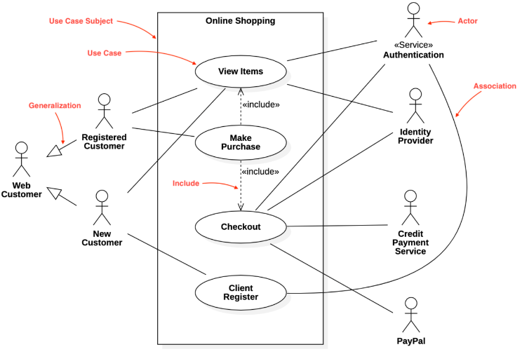
Ein Web Customer ist entweder Neu oder Registriert, während nur registrierte auf "Make Purchase" Zugriff haben. Neue haben auf "Client Register" Zugriff. Beide können Items Viewen.

### Use-Case-Diagramm 2

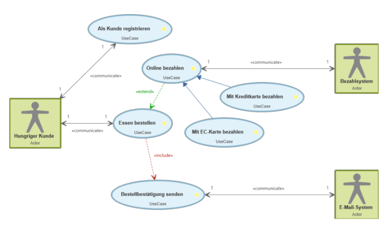
Ein einfaches System, um Essen zu bestellen, wobei Registrieren und Essen bestellen vom Kunde ausgehen kann. Essen bestellen wird dann zu Zahlen (dann auch Zahlmethoden) weitergeführt. Essen bestellen beinhaltet die Bestellbestätigung.

### Use-Case-Diagramm 3

- **Beschreibung**: Kino Gast kauft Kinokarten, bestellt Popcorn und Getränke, bezahlt Rechnung, Kreditkarte wird geprüft.
- **Diagramm**:

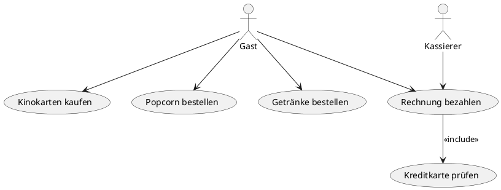

### Use-Case-Diagramm 4

- **Beschreibung**: Anwendungssystem für Krankenhausverwaltung mit Mitarbeitern und Patienten.
- **Diagramm**:

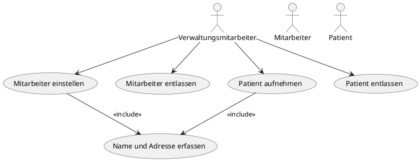

## KLASSENDIAGRAMME

### Klassendiagramm 1

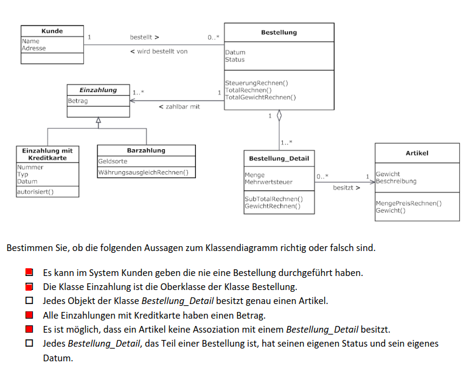

### Klassendiagramm 2

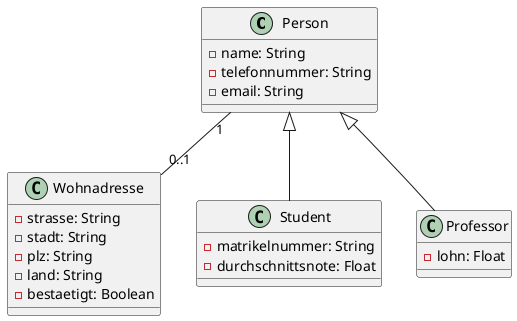

### Klassendiagramm 3

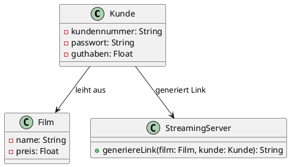

### Klassendiagramm 4

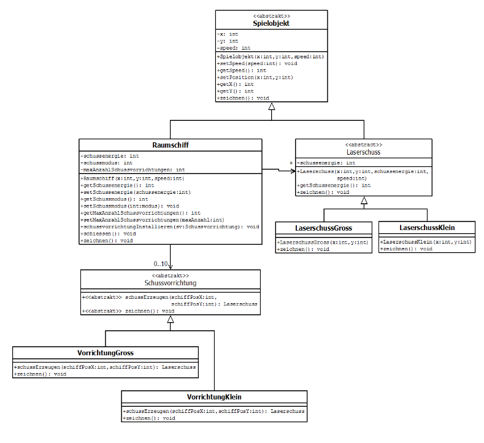
Spielobjekt als Inhärenzbasierende Entität eines Spieles. (Abstrakte Klasse)
Jedes Spielobjekt erbt von Spielobjekt.

Raumschiff als Spielobjekt
hat Schussvorrichtungen (abstrakt)
kann VorrichtungGriss und VorrichtungKlein sein, welche eine Methode schussErzeugen mit rückgabetyp Laserschuss haben

Laserschuss(abstrakt) erbt von Spielobjekt
aufgeteilt in Gross und Klein, kann gezeichnet werden

## SEQUENZDIAGRAMME

### Sequenzdiagramm 1

TODO

### Sequenzdiagramm 2

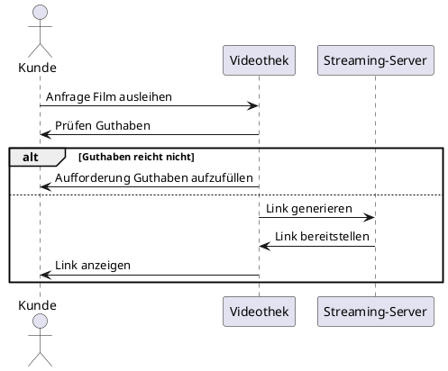

## AKTIVITÄTSDIAGRAMME

### Aktivitätsdiagramm 1

TODO

### Aktivitätsdiagramm 2

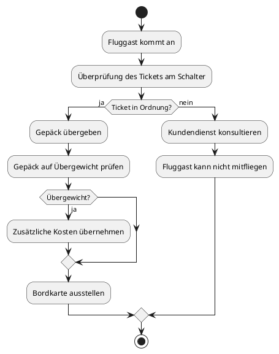

## ZUSTANDSDIAGRAMME

### Zustandsdiagramm 1

TODO

### Zustandsdiagramm 2

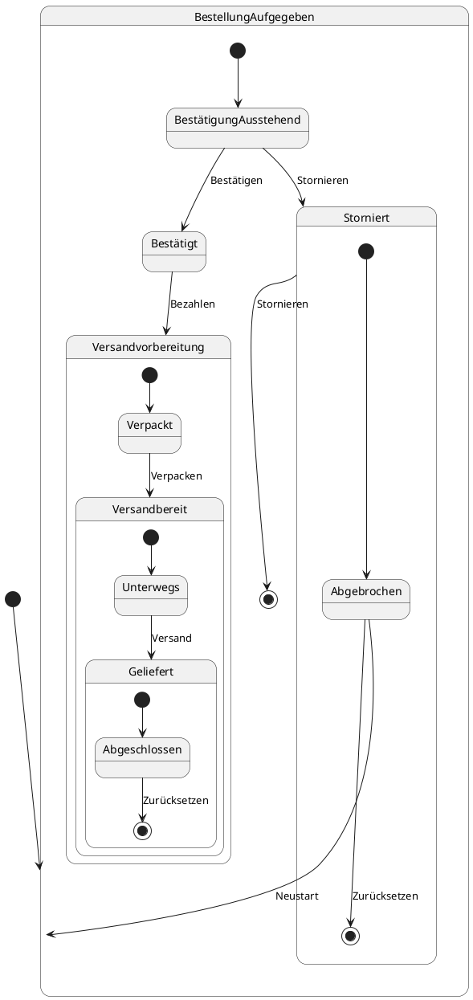

## C-4 DIAGRAMM

- C4-Modell zur Visualisierung von Architekturen von Softwaresystemen
  - Level 1: System Context diagram: Überblick über das gesamte System und seine Interaktionen mit externen Entitäten.
  - Level 2: Container diagram: Darstellung der Haupt-Container innerhalb des Systems und deren Interaktionen.
  - Level 3: Component diagram: Detailansicht der Komponenten innerhalb eines Containers.
  - Level 4: Klassendiagramm: Detaillierte Darstellung einzelner Komponenten.
