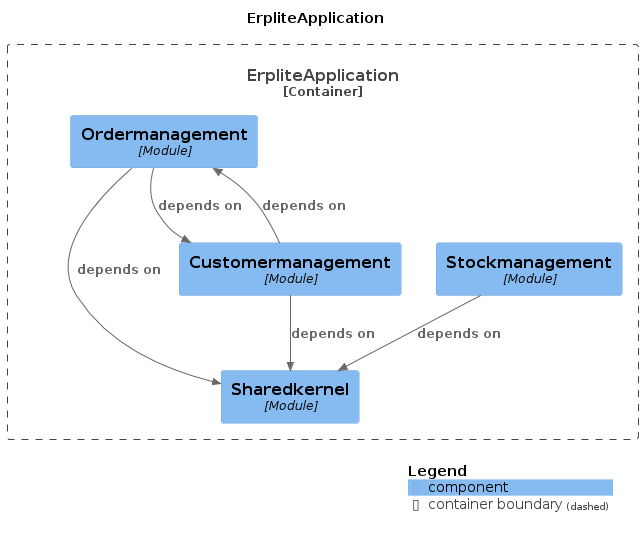
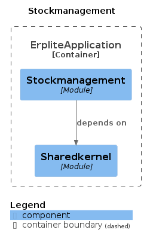

### A) Theorie:

#### 1. Was ist Softwarearchitektur?

Softwarearchitektur beschreibt die grundlegende Struktur einer Software und legt fest, wie verschiedene Komponenten miteinander interagieren. Sie definiert die Organisation des Systems, die Verteilung von Verantwortlichkeiten und die Zusammenarbeit der einzelnen Elemente. Dabei berücksichtigt sie funktionale und nicht-funktionale Anforderungen wie Performance, Skalierbarkeit, Wartbarkeit und Sicherheit.

#### 2. Wie kann man Softwarearchitektur dokumentieren?

Die Dokumentation von Softwarearchitektur kann auf verschiedene Weisen erfolgen:

- **Architekturbeschreibungen**: Textuelle Beschreibungen der Architektur, einschließlich Diagrammen, Konzepten und Entscheidungen.

- **Architekturdiagramme**: Visuelle Darstellungen der Architektur, wie z. B. UML-Diagramme, Flussdiagramme oder Schichtenmodelle.

- **Dokumentation von Entscheidungen (Architecture Decision Records, ADRs)**: Aufzeichnungen von Architekturentscheidungen, die den Kontext, die Probleme und die Lösungen dokumentieren.

#### 3. Welches sind die wichtigsten Eigenschaften von Langlebigen Softwarearchitekturen (Lilienthal)?

Langlebige Softwarearchitekturen, wie von Michael Lilienthal beschrieben, weisen folgende Eigenschaften auf:

- **Robustheit**: Das System kann Änderungen und Störungen standhalten, ohne zusammenzubrechen.

- **Flexibilität**: Die Architektur erlaubt es, das System einfach anzupassen und zu erweitern.

- **Wartbarkeit**: Die Software ist leicht zu verstehen und zu ändern, was die Wartungskosten senkt.

- **Skalierbarkeit**: Die Architektur erlaubt es, das System bei steigenden Anforderungen zu erweitern, ohne dass es an Leistung verliert.

- **Testbarkeit**: Die Softwarearchitektur ermöglicht effektive Tests, um die Qualität des Systems sicherzustellen.

#### 4. Was ist ein Modulith?

Ein Modulith ist eine Architektur, die Merkmale sowohl von monolithischen als auch von modularisierten Systemen vereint. Es handelt sich um eine monolithische Anwendung, die jedoch intern in gut abgegrenzte Module unterteilt ist. Dadurch können verschiedene Teile der Anwendung unabhängig voneinander entwickelt, getestet und skaliert werden, während sie als einzelne Einheit bereitgestellt werden.

#### 5. Wie funktioniert die Ports and Adapters Architektur?

Die Ports and Adapters Architektur, auch bekannt als Hexagonal Architecture, trennt die Geschäftslogik von externen Einflüssen wie Datenbanken, Benutzerschnittstellen oder externen Services. Die Architektur besteht aus drei Hauptkomponenten:

- **Ports**: Definieren die Schnittstellen, über die die Anwendung mit der Außenwelt kommuniziert. Sie sind unabhängig von der Implementierung und werden von der Geschäftslogik genutzt.

- **Adapter**: Implementieren die konkrete Kommunikation mit externen Ressourcen über die Ports. Sie übersetzen die Anfragen und Daten in das für die Anwendung verwendete Format.

- **Geschäftslogik**: Enthält die eigentliche Funktionalität der Anwendung, die unabhängig von den externen Einflüssen ist und über die Ports aufgerufen wird.

#### 6. DDD: Was sind die wesentlichen Bausteine des modellgetriebenen Entwurfs (Taktische Pattern) aus DDD?

Die wesentlichen Bausteine des modellgetriebenen Entwurfs (Taktische Pattern) aus Domain-Driven Design (DDD) sind:

- **Entity**: Objekte mit einer eindeutigen Identität, deren Zustand sich im Laufe der Zeit ändern kann. Sie repräsentieren Dinge mit Lebenszyklen.

- **Value Object**: Objekte, die keinen eigenen Lebenszyklus haben und nur durch ihre Eigenschaften definiert sind. Sie werden für Konzepte verwendet, die durch ihre Attribute beschrieben werden.

- **Aggregate**: Gruppen von zusammengehörigen Objekten, die als eine Einheit behandelt werden. Sie haben eine Wurzel-Entität, die den Zugriff auf die anderen Objekte steuert.

- **Repository**: Ein Mechanismus zum Abrufen und Speichern von Aggregaten aus der Datenquelle. Es kapselt die Datenzugriffsdetails und bietet eine saubere Schnittstelle für die Anwendung.

- **Service**: Funktionen, die keine natürliche Zugehörigkeit zu einer Entität haben, aber dennoch Teil des Domänenkonzepts sind.

- **Factory**: Erzeugt komplexe Objekte oder Aggregat knoten und kapselt die Erstellungslogik.

- **Module**: Organisatorische Einheiten, die zusammengehörige Teile des Domänenwissens kapseln und voneinander isolieren.

- **Event**: Ereignisse, die relevante Änderungen im System beschreiben und für die Synchronisation zwischen verschiedenen Teilen des Systems verwendet werden können.

# B) Architekturanalyse

## Modulith UML

## Modulith Spring dependency

# C) Modulith

Generiert mittels spring-modulith-docs, dann in mermaid konvertiert

Direkt von PUML

Die Library kann bei dem Testen und Erkennen von Zyklischen dependencies und genereller Analyse helfen.
